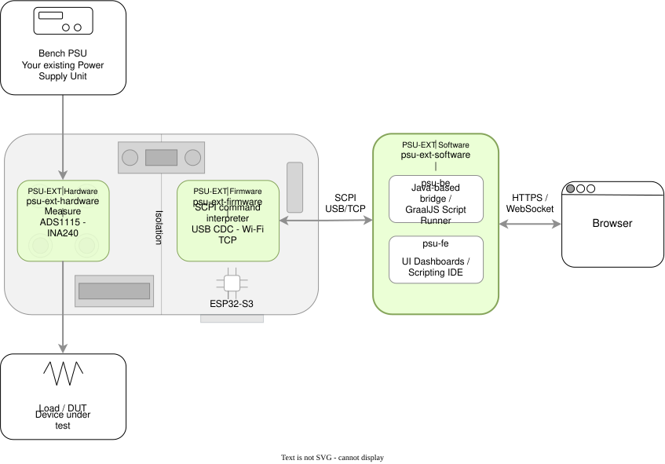

  

<h1 align="center"><a href="https://psuext.max-eelabs.com">PSU-EXT</a></h1>

  Programmable control, telemetry, and protection for the bench PSU you already own — 
  no replacement instrument required.

  
  

  
  
  

  

PSU-EXT is an inline hardware module and software stack: it sits between a
manual bench PSU and the load, adds isolated voltage/current measurement,
relay-controlled output switching, and OVP/OCP protection, and exposes SCPI
over USB and Wi-Fi. A browser dashboard and a built-in scripting IDE handle
telemetry, control, and test automation.

## How it fits together

PSU-EXT sits inline between a manual bench PSU and the load. The three core
repositories map to the three layers on that path — hardware measures and
switches, firmware controls and speaks SCPI, software puts that in front of
a person:

  

- **Hardware** — a galvanically isolated ADS1115/INA240 measurement front end
  and a GPIO-controlled relay sit between supply and load, so the control
  domain never shares a ground with what's under test.
- **Firmware** — an ESP32-S3 exposes that front end as SCPI over USB CDC or a
  Wi-Fi TCP server on port `5025`, with command groups for measurement,
  output control, OVP/OCP protection, external triggers, and timers.
- **Software** — `psu-be` (Java/Spring) either drives SCPI directly for
  scripted test automation, or proxies it over WebSocket to `psu-fe`, the
  React dashboard used for live telemetry and manual control.

Firmware and software agree on the same command set, documented in
[the SCPI reference](https://github.com/PSU-Ext-Org/psu-ext-firmware/blob/main/.doc/scpi-ref.md).

## Repositories

| Repo | What it is | Stack | License |
| --- | --- | --- | --- |
| [`psu-ext-hardware`](https://github.com/PSU-Ext-Org/psu-ext-hardware) | KiCad schematics, PCB layout, FreeCAD enclosure, manufacturing files (Gerbers, BOM, CPL) | KiCad 10, FreeCAD 1.1 | [CERN-OHL-S v2](https://github.com/PSU-Ext-Org/psu-ext-hardware/blob/main/LICENCE) |
| [`psu-ext-firmware`](https://github.com/PSU-Ext-Org/psu-ext-firmware) | ESP32-S3 firmware — SCPI over USB CDC & TCP, measurement, output control, protection, triggers, timers | ESP-IDF (C) | [Apache-2.0](https://github.com/PSU-Ext-Org/psu-ext-firmware/blob/main/LICENSE) |
| [`psu-ext-software`](https://github.com/PSU-Ext-Org/psu-ext-software) | `psu-be` WebSocket proxy + PC-side script runner, and `psu-fe` operator dashboard | Java 17 / Spring Boot, Vite + React | [Apache-2.0](https://github.com/PSU-Ext-Org/psu-ext-software/blob/main/LICENSE) |
| [`psu-ext`](https://github.com/PSU-Ext-Org/psu-ext) | Shared definitions and resources referenced across the project, plus documentation and customer-facing info | — | — |

## Links

[Crowd Supply](https://www.crowdsupply.com/maxeelabs/psu-ext) ·
[Project site](https://psu-ext-org.github.io) ·
[Demo video](https://www.youtube.com/watch?v=-SMOoRix2fA&list=PL6ckvcoRaXGZk9XdToRmbwaO-lrsME2fA&index=6) ·
[X/Twitter](https://x.com/MaxEELabs) ·
[LinkedIn](https://www.linkedin.com/in/pavlov-web/) ·
[Reddit](https://reddit.com/user/Negative-Plantain443)
